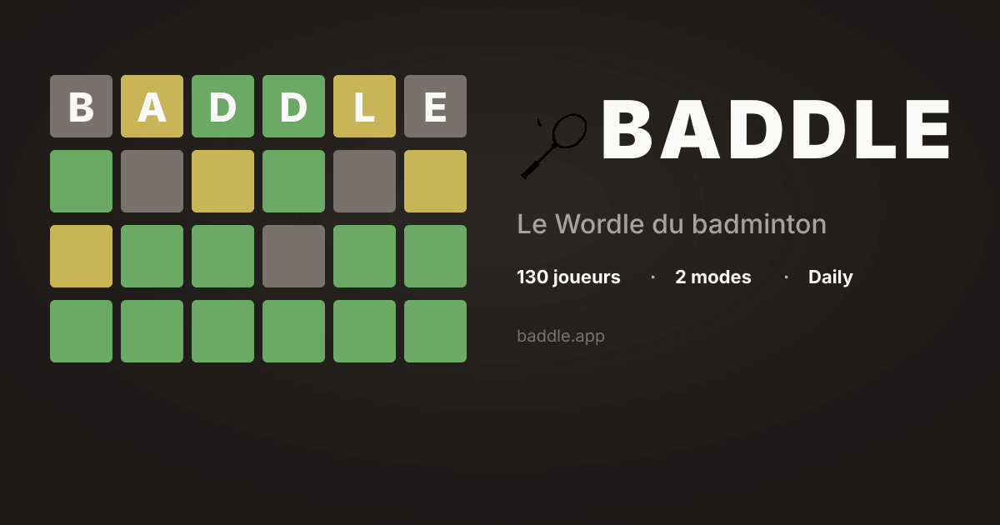

<div align="center">

# 🏸 Baddle

**Le Wordle du badminton — devine le joueur ou la joueuse mystère du jour parmi 130 légendes du circuit BWF.**



[**🎮 Jouer maintenant**](https://baddle.up.railway.app)

[](https://vitejs.dev)
[](https://react.dev)
[](https://www.typescriptlang.org)
[](https://tailwindcss.com)
[](#tests)

</div>

---

## ✨ Fonctionnalités

- **130 joueurs** scrapés et validés depuis Wikipedia (BWF + légendes historiques)
- **Deux modes de jeu** :
  - 🌍 **International** — 100+ joueurs du monde entier
  - 🇫🇷 **France** — 30 joueurs français (ancien⋅ne⋅s et actuel⋅le⋅s)
- **8 attributs comparés** : genre, pays, statut, discipline, main, âge, taille, classement BWF
- **Indices directionnels** ↑↓ sur les attributs ordinaux (âge, taille, classement)
- **Tier classement fin** : `N°1` · `Top 2` · `Top 3` · `Top 4` · `Top 5` · `Top 10` · `Top 20` · `Top 50`
- **Bilingue FR/EN** avec switcher live (formes féminines droitière/gauchère)
- **Animations** : flip à la révélation, célébration + confetti à la victoire
- **Stats séparées par mode** (parties, victoires, série, distribution)
- **Partage** via texte emoji façon Wordle (🟩🟧⬛)
- **Joueur du jour différent** par mode (seeds indépendants)
- **PWA installable** avec manifest + icons maskables
- **Mobile-first**, accessible (ARIA dialogs, ESC pour fermer, focus-visible)

---

## 🎨 Direction artistique

Palette Wordle officielle sur fond stone warm, cellules carrées avec animation flip 3D.

| Token | Hex | Usage |
|-------|-----|-------|
| `court-dark` | `#1c1917` | Fond principal |
| `court-mid` | `#292524` | Cards, inputs, modales |
| `court-surface` | `#3a3431` | Hover, surfaces élevées |
| `court-line` | `#44403c` | Bordures |
| `shuttle-white` | `#fafaf9` | Texte primaire |
| `shuttle-feather` | `#a8a29e` | Texte secondaire |
| `ace-green` | `#6aaa64` | ✓ Correct |
| `racket-orange` | `#f97316` | ~ Proche |
| `miss-grey` | `#78716c` | ✗ Incorrect |

Proportions inspirées de [onepiecedle.net](https://onepiecedle.net/classic) : grille uniforme 9 colonnes carrées, search 70px de hauteur, container `w-[90%] max-w-3xl`.

---

## 🚀 Quick start

```bash
git clone https://github.com/Logorrheique/baddle.git
cd baddle
npm install
npm run dev          # http://localhost:5173
```

### Scripts

| Commande | Description |
|----------|-------------|
| `npm run dev` | Serveur de développement Vite |
| `npm run build` | Build de production dans `dist/` |
| `npm run preview` | Preview du build prod en local |
| `npm start` | Sert `dist/` via `serve -s` (utilisé en prod Railway) |
| `npm test` | Lance tous les tests (Vitest) |
| `npm run test:watch` | Tests en mode watch |
| `npm run scrape:dry` | Scrape de test (3 joueurs, sans téléchargement images) |
| `npm run scrape` | Scrape complet (~130 joueurs + photos) |
| `npm run validate-data` | Vérifie l'intégrité de `players.json` |
| `npm run lint` | ESLint |

---

## 🗂️ Architecture

```
src/
├── components/         React components (Header, GuessTable, modals…)
├── lib/
│   ├── comparison.ts   Comparaison joueur deviné vs cible (correct/partial/incorrect)
│   ├── dailyPlayer.ts  Hash date → joueur du jour (seed par mode)
│   ├── i18n.ts         Dictionnaire FR/EN + display values traduits
│   ├── share.ts        Génération texte emoji pour partage
│   └── storage.ts      localStorage (par mode : game state + stats + lang)
├── hooks/              useGameState, useStats, useEscapeKey
├── types/player.ts     Types TypeScript (Gender, RankingTier…)
└── data/players.json   Base de données générée par le scraper

scripts/
├── scrape-players.ts   Pipeline principal de scraping
├── players-list.ts     Liste source { slug, wikiSlug, gender } × ~130
├── extract-infobox.ts  Parse infobox Wikipedia
├── parsers.ts          parseBirthDate, parseHeight, parseHandedness…
├── transforms.ts       ageToBracket, heightToBracket, rankingToTier
├── detect-discipline.ts Simple/Double/Mixte + status retraité
├── olympic-medals.ts   Or/Argent/Bronze/Aucune
├── count-titles.ts     0/1-3/4-9/10-19/20+
├── apply-overrides.ts  Applique manual-overrides.yaml
├── manual-overrides.yaml  Corrections manuelles validées
├── download-image.ts   Sharp resize 400×400 JPG
└── schema.ts           Zod validation post-overrides

public/players/         Photos des joueurs (400×400 JPG)
```

---

## 🤖 Ajouter un joueur

1. Ajouter une entrée dans `scripts/players-list.ts` :
   ```ts
   { slug: 'nom-joueur', wikiSlug: 'Nom_Wikipedia', gender: 'H' }
   ```
2. `npm run scrape`
3. Si certains champs sont incorrects, surcharger dans `scripts/manual-overrides.yaml` :
   ```yaml
   nom-joueur:
     status: "Retraité"
     bestRanking: "Top 5"
   ```
4. `npm run validate-data`

---

## 🧪 Tests

97 tests unitaires couvrant la logique pure :

- **comparison** — états correct/partial/incorrect, arrows ordinaux
- **dailyPlayer** — déterminisme, daysSinceEpoch, getPuzzleNumber
- **parsers** — birthDate, height, handedness, ranking
- **transforms** — brackets âge/taille, tiers ranking/titres

```bash
npm test
```

---

## 🚢 Déploiement

### Railway (production active)

```bash
railway login
railway link
railway up
```

Config : `railway.json` (Nixpacks · build `npm run build` · start `npm start` · healthcheck `/`).

### Cloudflare Pages

Production branch = `master`. Build automatique via wrangler 4.x avec auto-detection Vite.

### Vercel (alternative)

```bash
vercel --prod
```

Config : `vercel.json` (rewrites SPA inclus).

---

## 📚 Sources

- Fiches joueurs · taille · classement → [Wikipedia](https://en.wikipedia.org) (CC BY-SA 4.0)
- Photos → [Wikimedia Commons](https://commons.wikimedia.org) (licences libres)

---

## 🙏 Inspiration

Baddle est largement inspiré de **[Onedle](https://onedle.site/)** par **[@ekazukii](https://github.com/ekazukii/onedle)** : même concept "devine le perso du jour via attributs comparés", même rythme quotidien, mêmes proportions de grille. Si tu joues à Baddle, va voir Onedle — c'est l'original.

Autres références : [Wordle](https://www.nytimes.com/games/wordle/index.html) (la palette + l'idée de base) · [Poeltl](https://poeltl.dunk.town) (NBA) · [Loldle](https://loldle.net) (League of Legends).

---

<div align="center">

Made with 🏸 by [Logorrheique](https://github.com/Logorrheique)

</div>
